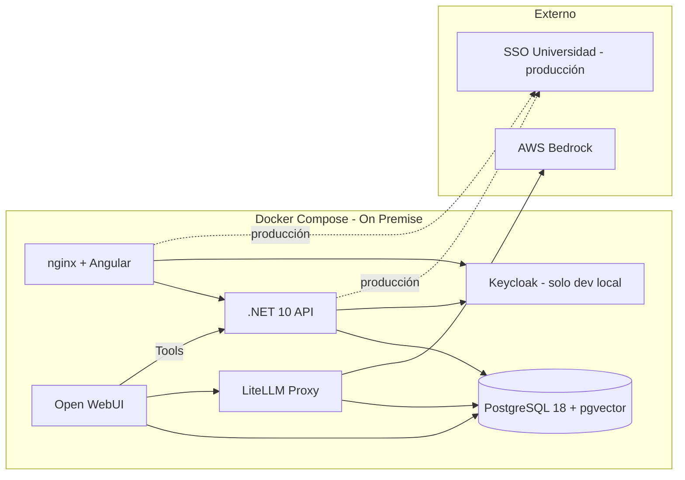

# Stack Técnico y Arquitectura

## 1. Visión General

Plataforma web de gestión de cartera de proyectos TIC para una universidad, con integración de agentes IA para consulta y ejecución de acciones mediante lenguaje natural. Diseñada para escalar a todas las áreas de la universidad.

## 2. Diagrama de Arquitectura


## 3. Stack Tecnológico

| Capa | Tecnología | Versión |
|------|-----------|---------|
| Frontend | Angular | 21 |
| UI Components | NG-ZORRO (Ant Design for Angular) | 21 |
| Kanban DnD | Angular CDK DragDropModule | 21 |
| Test runner (frontend) | Vitest | latest |
| Backend | .NET | 10 LTS |
| API Framework | ASP.NET Core Web API | 10 |
| ORM | Entity Framework Core | 10 |
| Documentación API | Microsoft.AspNetCore.OpenApi + Scalar | built-in / latest |
| CQRS | MediatR | 14+ |
| Validaciones | FluentValidation | 12+ |
| Base de datos | PostgreSQL | 18 |
| Vectores | pgvector + Pgvector.EntityFrameworkCore | 0.3+ |
| Agente IA UI | Open WebUI | latest |
| LLM Proxy | LiteLLM | latest |
| LLM Provider | AWS Bedrock (Claude/Nova) | - |
| Contenedores | Docker + Docker Compose | - |
| Auth | SAML2 / OAuth 2.0 (SSO universitario) | - |
| SSO (desarrollo local) | Keycloak | 26+ |
| Excel export | ClosedXML | 0.102+ |
| PDF export | QuestPDF | 2026+ |
| Testing backend | xUnit + NSubstitute + Shouldly | latest |
| Testing integración | Testcontainers | latest |
| Testing arquitectura | NetArchTest | latest |
| Testing E2E | Playwright | latest |

## 4. Arquitectura del Backend (Clean Architecture simplificada)

```
src/
├── CarteraProyectos.Api/            # Controllers, Middleware, OpenAPI/Scalar config
├── CarteraProyectos.Core/           # Entidades, Value Objects, Servicios, DTOs, Validaciones, Interfaces
└── CarteraProyectos.Infrastructure/ # EF Core, Repositorios, pgvector, Auth
```

> Se unifican Domain y Application en un único proyecto `Core` por pragmatismo. La separación lógica se mantiene con carpetas internas:

```
CarteraProyectos.Core/
├── Domain/          # Entidades, Value Objects, Enums
├── Services/        # Lógica de aplicación, handlers MediatR
├── DTOs/            # Objetos de transferencia
├── Interfaces/      # Contratos de repositorios e infraestructura
└── Validators/      # FluentValidation
```

## 5. Arquitectura del Frontend

```
src/app/
├── core/           # Servicios singleton, guards, interceptors, auth
├── shared/         # Componentes reutilizables (kanban-board, filtros)
├── features/
│   ├── dashboard/
│   ├── projects/
│   ├── teams/
│   ├── backlog/
│   ├── kanban/
│   ├── capacity/
│   └── reports/
└── models/         # Interfaces TypeScript
```

## 6. Agent Skills para desarrollo frontend

Se incluyen archivos de skills para que los agentes IA de desarrollo (Copilot, Claude Code, Cursor, Kiro, etc.) generen código Angular 21 idiomático con las prácticas actuales.

### Prácticas Angular 21 que cubren los skills:

- **Zoneless**: `provideZonelessChangeDetection()`, sin zone.js
- **Signals-first**: `signal()`, `computed()`, `effect()`, `linkedSignal()`, `toSignal()`
- **Standalone**: sin NgModules, componentes standalone obligatorio
- **inject()**: único patrón de DI, sin constructor injection
- **Control flow**: `@if`, `@for`, `@switch` (no directivas estructurales legacy)
- **Signal Forms**: formularios con señales (`@angular/forms/experimental`)
- **Vitest**: test runner por defecto, sin Karma
- **NG-ZORRO 21**: componentes UI con soporte zoneless y OnPush

### Estructura de archivos de skills:

```
.ai/
├── angular21-skill.md     # Skill Angular 21 (signals, zoneless, standalone, Vitest)
└── ng-zorro-llms.txt      # Referencia completa NG-ZORRO (from ng.ant.design/llms-full.txt)
```

### Referencias para configurar agentes:

| Agente | Configuración |
|--------|---------------|
| GitHub Copilot | `.github/copilot-instructions.md` referencia `.ai/angular21-skill.md` |
| Claude Code | `CLAUDE.md` referencia `.ai/angular21-skill.md` |
| Cursor | `.cursor/rules` referencia `.ai/angular21-skill.md` |
| Kiro | Contexto de proyecto referencia `.ai/` |
| Cualquier agente | Cargar `.ai/angular21-skill.md` como contexto/system prompt |

### Fuentes:

- Angular 21 skill: basado en [hereandnowai/agent-skills](https://github.com/hereandnowai/agent-skills)
- NG-ZORRO docs para LLMs: [ng.ant.design/llms-full.txt](https://ng.ant.design/llms-full.txt)

## 7. Estrategia de Testing

Pirámide de tests clásica: alto volumen de tests unitarios rápidos, menor número de tests de integración bien planteados, y tests E2E mínimos para flujos críticos.

### Backend (.NET 10)

| Nivel | Herramientas | Qué se prueba | Volumen |
|-------|-------------|---------------|---------|
| **Unit tests** | xUnit + NSubstitute + Shouldly | Handlers, validaciones, lógica de dominio, DTOs | Alto |
| **Integration tests** | xUnit + WebApplicationFactory + Testcontainers | Endpoints completos contra PostgreSQL real | Medio (flujos clave) |
| **Architecture tests** | NetArchTest | Core no depende de Infrastructure, convenciones de naming | Bajo |

### Frontend (Angular 21)

| Nivel | Herramientas | Qué se prueba | Volumen |
|-------|-------------|---------------|---------|
| **Unit tests** | Vitest + Angular Testing Library | Componentes, servicios, pipes, guards | Alto |
| **E2E** | Playwright | Flujos críticos (login, CRUD proyecto, Kanban drag&drop) | Bajo |

### Estructura de proyectos de tests

```
tests/
├── CarteraProyectos.UnitTests/          # Tests unitarios del Core (handlers, validaciones, dominio)
├── CarteraProyectos.IntegrationTests/   # Tests de API con WebApplicationFactory + Testcontainers
└── CarteraProyectos.ArchTests/          # Tests de arquitectura (dependencias entre capas)
```

### Principios de testing

- **Unit tests**: sin I/O, sin BD, mocking de dependencias externas. Deben ejecutarse en milisegundos.
- **Integration tests**: arrancan la API en memoria con una BD PostgreSQL real (Testcontainers). Prueban el flujo completo request → response incluyendo autenticación, validaciones y persistencia.
- **Cobertura objetivo**: alta en Core (dominio + servicios), media en API (endpoints), baja en Infrastructure (solo lo no trivial).

## 8. Infraestructura de Despliegue



> **Nota**: Los tres servicios (Backend, Open WebUI, LiteLLM) comparten la misma instancia de PostgreSQL 18, cada uno en su propia base de datos separada (`cartera_app`, `openwebui`, `litellm`).

## 9. Comunicación entre Componentes

| Origen | Destino | Protocolo | Autenticación |
|--------|---------|-----------|---------------|
| Angular | .NET API | REST/JSON | JWT (via SSO) |
| Open WebUI | .NET API | REST/JSON (OpenAPI Tools) | API Key |
| .NET API | PostgreSQL | TCP/SQL | Connection string (db: cartera_app) |
| Open WebUI | PostgreSQL | TCP/SQL | Connection string (db: openwebui) |
| LiteLLM | PostgreSQL | TCP/SQL | Connection string (db: litellm) |
| LiteLLM | AWS Bedrock | HTTPS/boto3 | AWS credentials |
| Angular/API | SSO | SAML2/OAuth | Redirect flow |

## 10. Decisiones Técnicas (ADR)

### ADR-001: PostgreSQL en lugar de Oracle

**Contexto**: La organización usa Oracle, pero se evalúa PostgreSQL para esta aplicación.

**Decisión**: Usar PostgreSQL con pgvector.

**Justificación**:
- pgvector permite búsqueda semántica nativa integrada con EF Core
- Menor coste de licenciamiento (open source)
- Mejor ecosistema para cargas de trabajo IA/ML
- Docker-friendly para desarrollo local
- Si en el futuro se necesita Oracle, EF Core abstrae el acceso a datos

**Consecuencias**: Necesidad de instalar y mantener PostgreSQL on-premise. El equipo debe familiarizarse con PostgreSQL si solo conoce Oracle.

### ADR-002: Angular CDK para Kanban en lugar de librería de terceros

**Contexto**: Se necesitan tableros Kanban con drag & drop.

**Decisión**: Usar Angular CDK DragDropModule + NG-ZORRO para el layout.

**Justificación**:
- Angular CDK es mantenido por el equipo de Angular (estabilidad a largo plazo)
- No añade dependencias externas de terceros con mantenimiento incierto
- NG-ZORRO proporciona los componentes de UI (cards, badges, avatars)
- Control total sobre el comportamiento y diseño

**Consecuencias**: Más trabajo inicial de implementación que una librería Kanban lista. Se compensa con flexibilidad total.

### ADR-003: Open WebUI + LiteLLM como capa de agente IA

**Contexto**: Se necesita un chat IA que interactúe con la plataforma.

**Decisión**: Open WebUI como interfaz de chat, LiteLLM como proxy a AWS Bedrock, y la API .NET registrada como OpenAPI Tool Server.

**Justificación**:
- Open WebUI soporta OpenAPI Tool Servers nativamente (cualquier API con spec OpenAPI 3.x)
- LiteLLM unifica el acceso a Bedrock con API compatible OpenAI
- Permite seguimiento de costes por usuario/equipo
- No requiere desarrollo de UI de chat propio (se puede añadir después)
- El agente puede invocar endpoints de la API directamente (consulta + acciones)

**Consecuencias**: Dependencia de Open WebUI como proyecto open source. A futuro se puede integrar un chat nativo en la app que use la misma API.

### ADR-004: Clean Architecture con MediatR (CQRS)

**Contexto**: Se necesita una arquitectura mantenible y testable para una aplicación con potencial de crecimiento.

**Decisión**: Clean Architecture con patrón CQRS implementado con MediatR.

**Justificación**:
- Separación clara de responsabilidades
- Facilita el testing unitario y de integración
- Escalable: nuevos features se añaden como handlers independientes
- Los endpoints para agentes IA y para el frontend comparten la misma lógica de aplicación

**Consecuencias**: Mayor boilerplate inicial. Se compensa con mantenibilidad a largo plazo.

### ADR-005: Autenticación SSO con OAuth 2.0/SAML2

**Contexto**: La universidad tiene un SSO que soporta SAML2 y OAuth.

**Decisión**: Usar OAuth 2.0 como protocolo principal con fallback SAML2.

**Justificación**:
- OAuth 2.0 es más simple de integrar con SPAs (Angular) mediante PKCE
- SAML2 se mantiene como opción para compatibilidad con otros servicios de la universidad
- ASP.NET Core tiene soporte nativo para ambos

**Consecuencias**: Se necesita configurar el Identity Provider de la universidad. Los tokens JWT se usan internamente para autorización.

**Entorno de desarrollo local**: Se usa Keycloak en Docker como simulador del SSO universitario. Se pre-carga un realm con usuarios de prueba (gestor, jefes de equipo, desarrolladores) para desarrollo sin dependencias externas. La configuración OAuth/SAML es idéntica, solo cambia la URL del Identity Provider entre desarrollo y producción.

### ADR-006: Arquitectura signal-first y zoneless (Angular 21)

**Contexto**: Angular 21 (noviembre 2025) completa la transición a una arquitectura moderna sin zone.js y basada en signals.

**Decisión**: Adoptar Angular 21 con todas las prácticas modernas por defecto.

**Justificación**:
- Zoneless elimina overhead de change detection (mejor rendimiento)
- Signals proporcionan reactividad granular y predecible
- Standalone components simplifican la arquitectura (sin NgModules)
- `inject()` es más explícito y tree-shakeable que constructor DI
- Vitest es más rápido que Karma y soporta testing zoneless nativo
- NG-ZORRO 21 soporta zoneless y OnPush nativamente
- Los agent skills garantizan que los agentes IA generan código idiomático Angular 21

**Patrones obligatorios**:
- `provideZonelessChangeDetection()` en app config
- `signal()`, `computed()`, `effect()` para estado reactivo
- `@if`, `@for`, `@switch` (nunca `*ngIf`, `*ngFor`)
- `inject()` (nunca constructor DI)
- Standalone components (nunca NgModules)
- Signal Forms para formularios nuevos (Reactive Forms como fallback estable)

**Consecuencias**: El equipo debe formarse en el paradigma signals-first. Se incluyen agent skills para acelerar el desarrollo asistido por IA.

### ADR-007: Autenticación JWT sin ASP.NET Identity (provisión automática)

**Contexto**: El SSO universitario gestiona la autenticación. Se necesita decidir cómo gestionar los usuarios localmente en el backend.

**Decisión**: No usar ASP.NET Identity. Implementar provisión automática de usuarios a partir de los claims del JWT.

**Flujo de autenticación**:
1. Angular redirige al SSO (Keycloak en dev / SSO universidad en prod) con OAuth 2.0 PKCE
2. El usuario se autentica en el SSO
3. El SSO redirige a Angular con un authorization code
4. Angular intercambia el code por un access token JWT (directamente con el SSO)
5. Angular envía el JWT en el header `Authorization: Bearer <token>` en cada petición
6. El backend .NET valida el JWT contra las claves públicas del SSO (JWKS endpoint)
7. Un middleware busca el usuario en la tabla `Person` por el claim `sub` (subject)
8. Si no existe, se crea automáticamente con los datos del token (nombre, email) y rol Desarrollador

**Justificación**:
- El SSO ya gestiona autenticación, passwords, 2FA — no duplicar funcionalidad
- ASP.NET Identity añade tablas y complejidad innecesarias (AspNetUsers, AspNetRoles, etc.)
- La tabla `Person` propia es más flexible y se integra con el modelo de dominio (equipos, tareas)
- El gestor de cartera asigna roles manualmente tras la primera autenticación

**Consecuencias**: No hay registro de usuarios en la app. La primera vez que alguien del SSO accede, se crea su perfil con rol mínimo. El gestor debe promocionar roles manualmente.

### ADR-008: Identificación de usuario en llamadas del agente IA

**Contexto**: Cuando un usuario interactúa con el agente IA en Open WebUI y este invoca la API, se necesita saber qué usuario está detrás para aplicar permisos y registrar autoría.

**Decisión**: Open WebUI comparte el mismo SSO que la app. El header `X-Open-WebUI-User-Email` identifica al usuario en cada llamada al Tool Server.

**Justificación**:
- Open WebUI soporta OAuth/OIDC, se conecta al mismo Keycloak/SSO
- El usuario se autentica una vez y Open WebUI pasa su email al Tool Server automáticamente
- La API busca la `Person` por email y ejecuta la acción con sus permisos
- Comunicación interna (Docker network) + API Key asegura que el header no se puede falsificar desde fuera

**Consecuencias**: Open WebUI debe configurarse con el mismo SSO. Los permisos del usuario se respetan también en el chat (un desarrollador no puede hacer acciones de gestor vía agente).

### ADR-009: OpenAPI nativo de .NET 10 + Scalar (sin Swashbuckle)

**Contexto**: .NET 10 incluye generación nativa de documentos OpenAPI. Swashbuckle ha sido eliminado de las plantillas oficiales y su mantenimiento es incierto.

**Decisión**: Usar `Microsoft.AspNetCore.OpenApi` para generar la spec OpenAPI 3.1 y `Scalar.AspNetCore` como UI interactiva de documentación.

**Justificación**:
- `Microsoft.AspNetCore.OpenApi` es built-in en .NET 10, sin dependencias externas
- Genera OpenAPI 3.1 (última versión del estándar)
- Scalar ofrece UI moderna, interactiva y mejor experiencia que Swagger UI
- La spec OpenAPI generada es la misma que consume Open WebUI como Tool Server
- Swashbuckle está deprecated y sin mantenimiento activo

**Consecuencias**: No se usa Swashbuckle ni Swagger UI. La documentación interactiva se accede vía Scalar en `/scalar`. La spec JSON se sirve en `/openapi/v1.json`.
