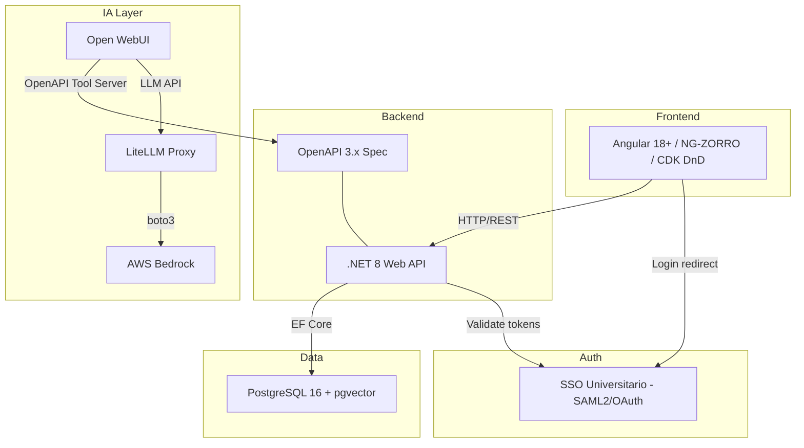
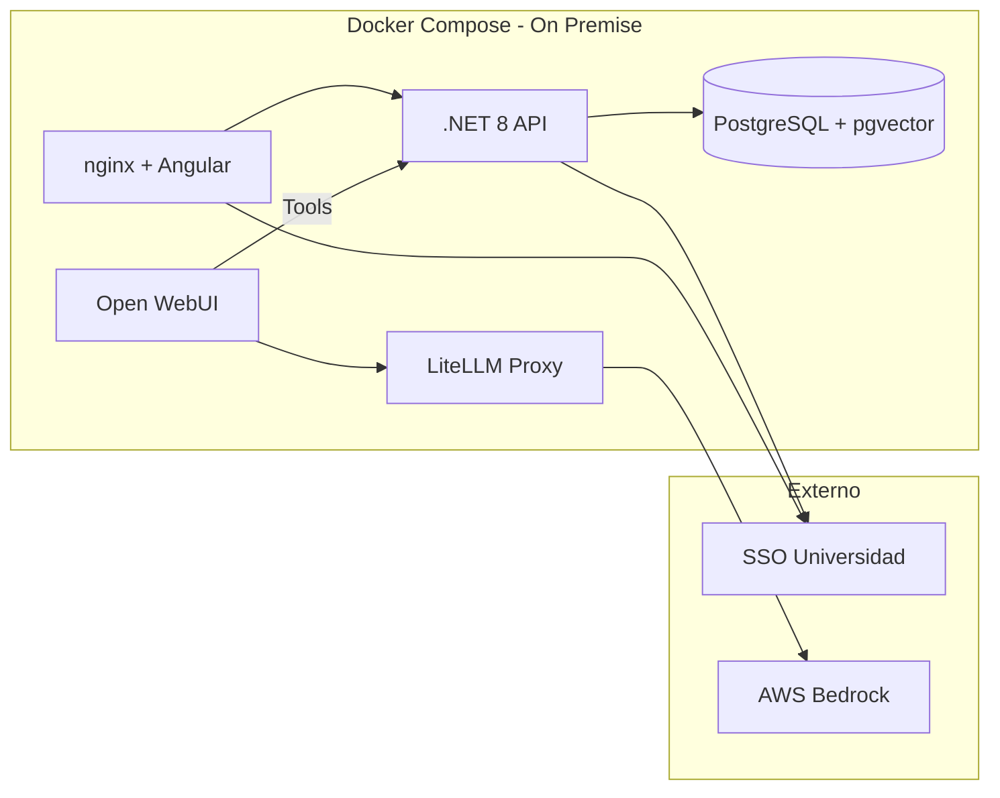

# Stack Técnico y Arquitectura

## 1. Visión General

Plataforma web de gestión de cartera de proyectos TIC para una universidad, con integración de agentes IA para consulta y ejecución de acciones mediante lenguaje natural. Diseñada para escalar a todas las áreas de la universidad.

## 2. Diagrama de Arquitectura



## 3. Stack Tecnológico

| Capa | Tecnología | Versión |
|------|-----------|---------|
| Frontend | Angular | 18+ |
| UI Components | NG-ZORRO (Ant Design for Angular) | 18+ |
| Kanban DnD | Angular CDK DragDropModule | 18+ |
| Backend | .NET | 8 LTS |
| API Framework | ASP.NET Core Web API | 8 |
| ORM | Entity Framework Core | 8 |
| CQRS | MediatR | 12+ |
| Validaciones | FluentValidation | 11+ |
| Base de datos | PostgreSQL | 16+ |
| Vectores | pgvector + Pgvector.EntityFrameworkCore | 0.3+ |
| Agente IA UI | Open WebUI | latest |
| LLM Proxy | LiteLLM | latest |
| LLM Provider | AWS Bedrock (Claude/Nova) | - |
| Contenedores | Docker + Docker Compose | - |
| Auth | SAML2 / OAuth 2.0 (SSO universitario) | - |
| Excel export | ClosedXML | 0.102+ |
| PDF export | QuestPDF | 2024+ |

## 4. Arquitectura del Backend (Clean Architecture)

```
src/
├── CarteraProyectos.Api/            # Controllers, Middleware, OpenAPI config
├── CarteraProyectos.Application/    # Servicios, CQRS (MediatR), DTOs, Validaciones
├── CarteraProyectos.Domain/         # Entidades, Value Objects, Interfaces
└── CarteraProyectos.Infrastructure/ # EF Core, Repositorios, pgvector, Auth
```

## 5. Arquitectura del Frontend

```
src/app/
├── core/           # Servicios singleton, guards, interceptors, auth
├── shared/         # Componentes reutilizables (kanban-board, filtros)
├── features/
│   ├── dashboard/
│   ├── projects/
│   ├── teams/
│   ├── backlog/
│   ├── kanban/
│   ├── capacity/
│   └── reports/
└── models/         # Interfaces TypeScript
```

## 6. Infraestructura de Despliegue



## 7. Comunicación entre Componentes

| Origen | Destino | Protocolo | Autenticación |
|--------|---------|-----------|---------------|
| Angular | .NET API | REST/JSON | JWT (via SSO) |
| Open WebUI | .NET API | REST/JSON (OpenAPI Tools) | API Key |
| .NET API | PostgreSQL | TCP/SQL | Connection string |
| LiteLLM | AWS Bedrock | HTTPS/boto3 | AWS credentials |
| Angular/API | SSO | SAML2/OAuth | Redirect flow |

## 8. Decisiones Técnicas (ADR)

### ADR-001: PostgreSQL en lugar de Oracle

**Contexto**: La organización usa Oracle, pero se evalúa PostgreSQL para esta aplicación.

**Decisión**: Usar PostgreSQL con pgvector.

**Justificación**:
- pgvector permite búsqueda semántica nativa integrada con EF Core
- Menor coste de licenciamiento (open source)
- Mejor ecosistema para cargas de trabajo IA/ML
- Docker-friendly para desarrollo local
- Si en el futuro se necesita Oracle, EF Core abstrae el acceso a datos

**Consecuencias**: Necesidad de instalar y mantener PostgreSQL on-premise. El equipo debe familiarizarse con PostgreSQL si solo conoce Oracle.

### ADR-002: Angular CDK para Kanban en lugar de librería de terceros

**Contexto**: Se necesitan tableros Kanban con drag & drop.

**Decisión**: Usar Angular CDK DragDropModule + NG-ZORRO para el layout.

**Justificación**:
- Angular CDK es mantenido por el equipo de Angular (estabilidad a largo plazo)
- No añade dependencias externas de terceros con mantenimiento incierto
- NG-ZORRO proporciona los componentes de UI (cards, badges, avatars)
- Control total sobre el comportamiento y diseño

**Consecuencias**: Más trabajo inicial de implementación que una librería Kanban lista. Se compensa con flexibilidad total.

### ADR-003: Open WebUI + LiteLLM como capa de agente IA

**Contexto**: Se necesita un chat IA que interactúe con la plataforma.

**Decisión**: Open WebUI como interfaz de chat, LiteLLM como proxy a AWS Bedrock, y la API .NET registrada como OpenAPI Tool Server.

**Justificación**:
- Open WebUI soporta OpenAPI Tool Servers nativamente (cualquier API con spec OpenAPI 3.x)
- LiteLLM unifica el acceso a Bedrock con API compatible OpenAI
- Permite seguimiento de costes por usuario/equipo
- No requiere desarrollo de UI de chat propio (se puede añadir después)
- El agente puede invocar endpoints de la API directamente (consulta + acciones)

**Consecuencias**: Dependencia de Open WebUI como proyecto open source. A futuro se puede integrar un chat nativo en la app que use la misma API.

### ADR-004: Clean Architecture con MediatR (CQRS)

**Contexto**: Se necesita una arquitectura mantenible y testable para una aplicación con potencial de crecimiento.

**Decisión**: Clean Architecture con patrón CQRS implementado con MediatR.

**Justificación**:
- Separación clara de responsabilidades
- Facilita el testing unitario y de integración
- Escalable: nuevos features se añaden como handlers independientes
- Los endpoints para agentes IA y para el frontend comparten la misma lógica de aplicación

**Consecuencias**: Mayor boilerplate inicial. Se compensa con mantenibilidad a largo plazo.

### ADR-005: Autenticación SSO con OAuth 2.0/SAML2

**Contexto**: La universidad tiene un SSO que soporta SAML2 y OAuth.

**Decisión**: Usar OAuth 2.0 como protocolo principal con fallback SAML2.

**Justificación**:
- OAuth 2.0 es más simple de integrar con SPAs (Angular) mediante PKCE
- SAML2 se mantiene como opción para compatibilidad con otros servicios de la universidad
- ASP.NET Core tiene soporte nativo para ambos

**Consecuencias**: Se necesita configurar el Identity Provider de la universidad. Los tokens JWT se usan internamente para autorización.
