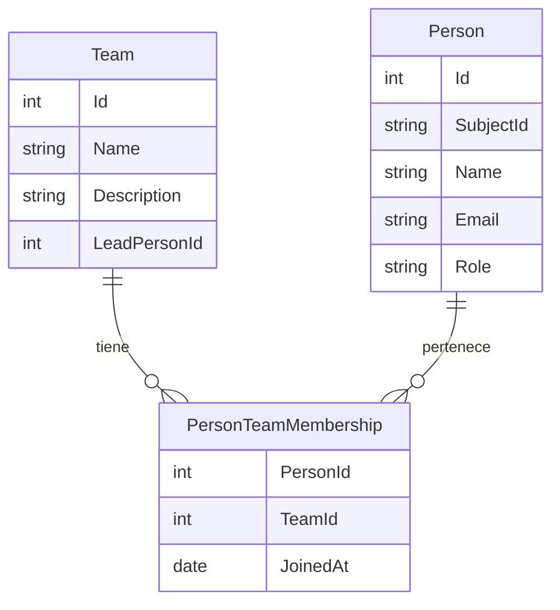

# Gestión de Equipos y Personas

## Descripción

Gestión de los equipos de desarrollo y las personas que los componen. Una persona puede pertenecer a más de un equipo simultáneamente.

## Modelo de datos

> **Nota sobre roles**: El campo `Role` en `Person` define los permisos globales en la plataforma. El campo `LeadPersonId` en `Team` indica quién lidera ese equipo concreto. Una persona con rol "Jefe de equipo" tiene permisos de gestión **solo sobre los equipos donde es `LeadPersonId`**. Un "Desarrollador" no puede ser `LeadPersonId`. Si se asigna a alguien como líder de equipo, su rol debe ser al menos "Jefe de equipo".

- **SubjectId**: Claim `sub` del JWT del SSO. Identificador único externo usado para la provisión automática de usuarios (ver `08-autenticacion-roles.md`). Único y obligatorio tras el primer login.

## Historias de Usuario

### HU-EP-01: Crear equipo de desarrollo

**Como** gestor de cartera,
**quiero** crear un equipo de desarrollo con un nombre y descripción,
**para** poder organizar a las personas en grupos de trabajo.

**Criterios de aceptación:**
- El nombre del equipo es obligatorio y único
- Se puede asignar opcionalmente un jefe de equipo
- El equipo queda visible en el listado de equipos

---

### HU-EP-02: Editar y eliminar equipo

**Como** gestor de cartera,
**quiero** editar los datos de un equipo o eliminarlo si ya no está activo,
**para** mantener actualizada la estructura organizativa.

**Criterios de aceptación:**
- Se pueden editar nombre, descripción y jefe de equipo
- Solo se puede eliminar un equipo sin proyectos activos asignados
- Al intentar eliminar un equipo con proyectos activos se muestra un aviso

---

### HU-EP-03: Registrar persona

**Como** gestor de cartera,
**quiero** registrar a una persona en el sistema con sus datos básicos,
**para** poder asignarla a equipos y tareas.

**Criterios de aceptación:**
- Datos: nombre, email, rol en la plataforma (Gestor/Jefe de equipo/Desarrollador)
- El email es único y se vincula con la identidad del SSO
- La persona queda disponible para asignar a equipos

---

### HU-EP-04: Asignar persona a equipos

**Como** gestor de cartera,
**quiero** asignar una persona a uno o más equipos de desarrollo,
**para** reflejar que una persona puede colaborar en varios equipos.

**Criterios de aceptación:**
- Una persona puede pertenecer a múltiples equipos simultáneamente
- Se muestra la lista de equipos actuales de la persona
- Se puede añadir o quitar la pertenencia a un equipo

---

### HU-EP-05: Ver composición de un equipo

**Como** jefe de equipo,
**quiero** ver qué personas forman parte de mi equipo,
**para** conocer los recursos disponibles.

**Criterios de aceptación:**
- Se muestra la lista de miembros del equipo con su rol
- Se indica si la persona pertenece a otros equipos
- Se muestra el número de tareas activas de cada miembro

---

### HU-EP-06: Ver equipos de una persona

**Como** gestor de cartera,
**quiero** ver a qué equipos pertenece una persona,
**para** entender su contexto organizativo y carga distribuida.

**Criterios de aceptación:**
- Se listan todos los equipos a los que pertenece la persona
- Se muestra el rol que tiene en cada equipo (si aplica)
