# Gestión de Proyectos y Cartera

## Descripción

Gestión del ciclo de vida de proyectos. Los proyectos pueden estar incluidos en la cartera de un año concreto o ser proyectos fuera de cartera. Un proyecto puede asignarse a múltiples equipos, tiene un promotor institucional y una unidad orgánica solicitante, puede etiquetarse libremente y mantiene un histórico de notas de seguimiento.

## Modelo de datos

```mermaid
erDiagram
    Project ||--o{ ProjectTeamAssignment : asignado
    Team ||--o{ ProjectTeamAssignment : trabaja
    Project }o--|| Promoter : promovido_por
    Project }o--|| OrganicUnit : solicitado_por
    Project ||--o{ ProjectTags : etiquetado
    Tag ||--o{ ProjectTags : usada_en
    Project ||--o{ ProjectNote : tiene
    Person ||--o{ ProjectNote : autor
    Project {
        int Id
        string Title
        string Description
        string RequestingUnit "legacy, nullable"
        enum Complexity
        enum Status
        int PortfolioYear
        date StartDate
        date EndDate
        int PreviousReferenceId
        int BeneficiaryCount
        int PromoterId
        int OrganicUnitId
        int UorOrder
        int GroupPriority
        enum SiptGroup
        date DesiredDeploymentDate
        string SpecificationsUrl
        string EpicUrl
    }
    Promoter {
        int Id
        string Name
    }
    OrganicUnit {
        int Id
        string Name
        string Code
    }
    Tag {
        int Id
        string Name
        string Color
    }
    ProjectNote {
        int Id
        int ProjectId
        int AuthorId
        string Text
        datetime CreatedAt
    }
    ProjectTeamAssignment {
        int ProjectId
        int TeamId
        bool IsPrimary
    }
```

### Enumerados

| Enum | Valores |
|------|---------|
| `ProjectStatus` | `Stopped` (Parado), `PlanningWithClient` (Planificando con cliente), `WaitingForDevelopers` (Esperando desarrolladores), `PlanningSprint` (Planificando sprint), `InSprint` (En sprint), `DevelopmentOutsideSprint` (Desarrollo fuera de sprint), `InTesting` (En pruebas), `Completed` (Finalizado), `PostponedByClient` (Pospuesto por cliente) |
| `ProjectComplexity` | `VerySmall` (Muy pequeño), `Small` (Pequeño), `Medium` (Medio), `Large` (Grande), `VeryLarge` (Muy grande) |
| `SiptGroup` | `WebTransversal`, `RRHH`, `Academico`, `Sede`, `Observatorio`, `InvestigacionEconomico` |

> El estado del proyecto **no sigue una máquina de estados restrictiva**: cualquier estado puede transicionar a cualquier otro. La única restricción es de rol (ver HU-PR-04).

## Catálogos administrables

Tres catálogos de apoyo, gestionados exclusivamente por el Gestor de cartera desde `/admin`:

- **Promotores** (`Promoter`): institución o unidad que promueve el proyecto. CRUD en `/api/promoters`.
- **Unidades orgánicas** (`OrganicUnit`): unidad solicitante, con nombre y código opcional. CRUD en `/api/organic-units`. Sustituye semánticamente al antiguo campo de texto libre `RequestingUnit` (que se mantiene en la BD, ahora opcional, solo por compatibilidad con datos antiguos).
- **Etiquetas** (`Tag`): etiquetas de cartera con nombre y color, asociables a múltiples proyectos. CRUD en `/api/tags`.

Ninguno de los tres catálogos puede eliminarse mientras tenga proyectos asociados (Promotores, Unidades orgánicas), salvo las Etiquetas, que al eliminarse se desasocian automáticamente de los proyectos.

## Historias de Usuario

### HU-PR-01: Crear proyecto

**Como** gestor de cartera,
**quiero** crear un proyecto con sus datos descriptivos,
**para** registrarlo en el sistema y poder planificar su ejecución.

**Criterios de aceptación:**
- Campos obligatorios: título (máx. 150 caracteres), complejidad
- Campos opcionales: descripción, unidad orgánica solicitante, promotor, fecha inicio prevista, fecha fin prevista, referencia anterior, nº de beneficiarios, orden UOR, prioridad de grupo (1-5), grupo SIPT, fecha deseada de implantación, URL de especificaciones, URL de épica externa, etiquetas
- El proyecto se crea en estado `Stopped` (Parado) por defecto
- Se genera un identificador único automáticamente

---

### HU-PR-02: Marcar proyecto como cartera de un año

**Como** gestor de cartera,
**quiero** marcar un proyecto como parte de la cartera de un año determinado,
**para** identificar los compromisos de cartera y diferenciarlos de otros proyectos.

**Criterios de aceptación:**
- Se puede asignar un año de cartera (ej: 2026)
- Un proyecto puede no tener año de cartera (proyecto fuera de cartera)
- Se puede cambiar o quitar el año de cartera posteriormente
- Los proyectos de cartera se distinguen visualmente en los listados

---

### HU-PR-03: Asignar proyecto a equipos

**Como** gestor de cartera,
**quiero** asignar un proyecto a uno o más equipos de desarrollo,
**para** repartir la responsabilidad de ejecución entre varios equipos cuando sea necesario.

**Criterios de aceptación:**
- Un proyecto puede asignarse a múltiples equipos
- Se puede indicar un equipo principal (responsable)
- Los equipos asignados ven el proyecto en su lista de trabajo
- Se puede desasignar un equipo de un proyecto

---

### HU-PR-04: Cambiar estado de un proyecto

**Como** gestor de cartera o jefe de equipo del proyecto,
**quiero** cambiar el estado de un proyecto,
**para** reflejar su situación real en cada momento.

**Criterios de aceptación:**
- Estados disponibles: Parado, Planificando con cliente, Esperando desarrolladores, Planificando sprint, En sprint, Desarrollo fuera de sprint, En pruebas, Finalizado, Pospuesto por cliente
- **No existe restricción de transición entre estados**: cualquier estado puede pasar a cualquier otro estado, en cualquier orden
- Solo el Gestor de cartera, o un Jefe de equipo de alguno de los equipos asignados al proyecto, puede cambiar el estado
- Un Desarrollador no puede cambiar el estado de un proyecto

**Permisos:**

| Rol | ¿Puede cambiar el estado? |
|-----|---------------------------|
| Gestor de cartera | Sí, siempre |
| Jefe de equipo | Sí, si pertenece a algún equipo asignado al proyecto (no necesariamente el primario) |
| Desarrollador | No |

---

### HU-PR-05: Filtrar y buscar proyectos

**Como** gestor de cartera,
**quiero** filtrar proyectos por múltiples criterios,
**para** encontrar rápidamente la información que necesito.

**Criterios de aceptación:**
- Filtros combinables: año de cartera (`year`), estado (`status`), equipo (`teamId`), complejidad (`complexity`), grupo SIPT (`siptGroup`), promotor (`promoterId`), etiqueta — una (`tagId`) o varias (`tagIds`)
- Búsqueda por texto libre (`q`) en título y descripción
- Resultado paginado (`page`, `pageSize`, máx. 100)
- Los filtros se mantienen al navegar y volver
- Se muestra el número total de resultados

---

### HU-PR-06: Ver detalle de proyecto

**Como** cualquier usuario con acceso,
**quiero** ver toda la información de un proyecto en una vista de detalle,
**para** entender su alcance, equipos asignados, etiquetas y estado actual.

**Criterios de aceptación:**
- Se muestran todos los datos del proyecto, incluidos los campos ampliados (promotor, unidad orgánica, prioridad de grupo, grupo SIPT, fechas, URLs externas)
- Se listan los equipos asignados y las etiquetas
- Se muestra el resumen de épicas y tareas (total, completadas, pendientes)
- Se muestra el historial de notas de seguimiento (ver HU-PR-08)
- Se muestra el historial de actualizaciones semanales de avance, con su indicador de estado de salud (ver `07-informes-seguimiento.md`, HU-IN-00)

---

### HU-PR-07: Gestionar catálogos de Promotores, Unidades orgánicas y Etiquetas

**Como** gestor de cartera,
**quiero** mantener los catálogos de Promotores, Unidades orgánicas y Etiquetas,
**para** disponer de listas controladas al describir proyectos.

**Criterios de aceptación:**
- CRUD completo de cada catálogo, accesible solo para el Gestor (`/admin/promoters`, `/admin/organic-units`, `/admin/tags`)
- Promotores y Unidades orgánicas no se pueden eliminar si tienen proyectos asociados
- Las Etiquetas se pueden eliminar en cualquier momento; al hacerlo se desasocian automáticamente de los proyectos que las usaban
- Las Etiquetas admiten un color (hex) para diferenciarlas visualmente

---

### HU-PR-08: Añadir nota de seguimiento a un proyecto

**Como** gestor de cartera o jefe de equipo del proyecto,
**quiero** añadir notas de seguimiento a un proyecto,
**para** documentar decisiones, hitos o bloqueos a lo largo de su ciclo de vida.

**Criterios de aceptación:**
- Las notas tienen texto, autor y fecha de creación
- Se muestran en el detalle del proyecto en orden cronológico
- El agente IA puede añadir notas de proyecto en nombre del usuario (ver `10-integracion-agente-ia.md`)
- Solo el autor de la nota o el Gestor pueden eliminarla
