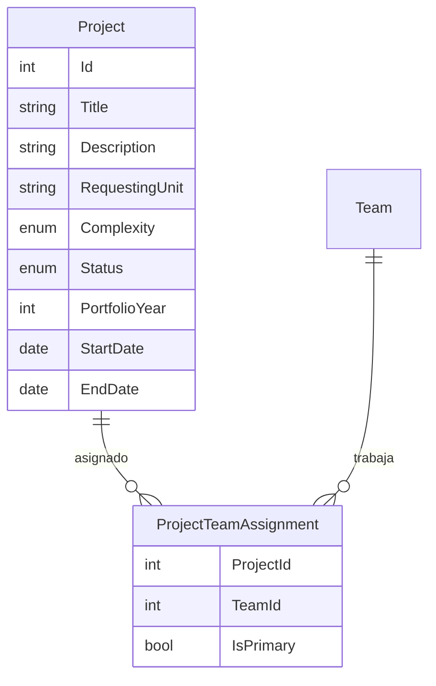

# Gestión de Proyectos y Cartera

## Descripción

Gestión del ciclo de vida de proyectos. Los proyectos pueden estar incluidos en la cartera de un año concreto o ser proyectos fuera de cartera. Un proyecto puede asignarse a múltiples equipos.

## Modelo de datos

## Historias de Usuario

### HU-PR-01: Crear proyecto

**Como** gestor de cartera,
**quiero** crear un proyecto con sus datos descriptivos,
**para** registrarlo en el sistema y poder planificar su ejecución.

**Criterios de aceptación:**
- Campos obligatorios: título, unidad solicitante, complejidad estimada
- Campos opcionales: descripción, fecha inicio prevista, fecha fin prevista
- El proyecto se crea en estado "Propuesto"
- Se genera un identificador único automáticamente

---

### HU-PR-02: Marcar proyecto como cartera de un año

**Como** gestor de cartera,
**quiero** marcar un proyecto como parte de la cartera de un año determinado,
**para** identificar los compromisos de cartera y diferenciarlos de otros proyectos.

**Criterios de aceptación:**
- Se puede asignar un año de cartera (ej: 2026)
- Un proyecto puede no tener año de cartera (proyecto fuera de cartera)
- Se puede cambiar o quitar el año de cartera posteriormente
- Los proyectos de cartera se distinguen visualmente en los listados

---

### HU-PR-03: Asignar proyecto a equipos

**Como** gestor de cartera,
**quiero** asignar un proyecto a uno o más equipos de desarrollo,
**para** repartir la responsabilidad de ejecución entre varios equipos cuando sea necesario.

**Criterios de aceptación:**
- Un proyecto puede asignarse a múltiples equipos
- Se puede indicar un equipo principal (responsable)
- Los equipos asignados ven el proyecto en su lista de trabajo
- Se puede desasignar un equipo de un proyecto

---

### HU-PR-04: Cambiar estado de un proyecto

**Como** gestor de cartera,
**quiero** cambiar el estado de un proyecto a lo largo de su ciclo de vida,
**para** reflejar su progreso real.

**Criterios de aceptación:**
- Estados posibles: Propuesto → Aprobado → En ejecución → Pausado → Completado → Cancelado
- Se registra la fecha de cada cambio de estado
- Solo ciertos roles pueden cambiar a ciertos estados (ej: solo Gestor puede Aprobar)

---

### HU-PR-05: Filtrar y buscar proyectos

**Como** gestor de cartera,
**quiero** filtrar proyectos por cartera/año, estado, equipo asignado y unidad solicitante,
**para** encontrar rápidamente la información que necesito.

**Criterios de aceptación:**
- Filtros combinables: año de cartera, estado, equipo, unidad solicitante, complejidad
- Búsqueda por texto en título y descripción
- Los filtros se mantienen al navegar y volver
- Se muestra el número total de resultados

---

### HU-PR-06: Ver detalle de proyecto

**Como** cualquier usuario con acceso,
**quiero** ver toda la información de un proyecto en una vista de detalle,
**para** entender su alcance, equipos asignados y estado actual.

**Criterios de aceptación:**
- Se muestran todos los datos del proyecto
- Se listan los equipos asignados
- Se muestra el resumen de épicas y tareas (total, completadas, pendientes)
- Se muestra el historial de cambios de estado
