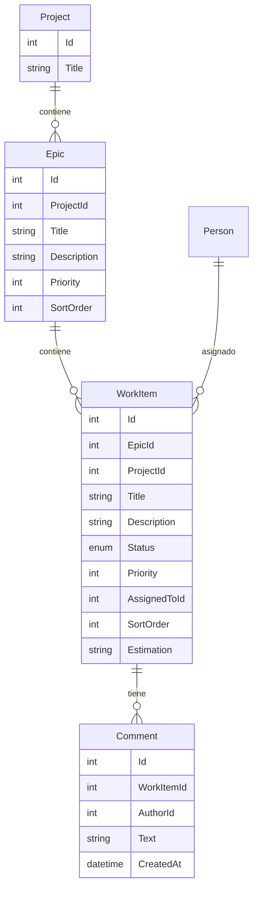

# Épicas, Tareas y Backlog

## Descripción

Gestión del trabajo a nivel granular. Los proyectos se descomponen en épicas y tareas. Existen también tareas sin proyecto (backlog general) para trabajo que no pertenece a ningún proyecto específico.

## Modelo de datos

## Historias de Usuario

### HU-TB-01: Crear épica dentro de un proyecto

**Como** jefe de equipo,
**quiero** crear épicas dentro de un proyecto,
**para** organizar el trabajo en bloques funcionales grandes.

**Criterios de aceptación:**
- Una épica tiene título, descripción y prioridad
- Pertenece a un único proyecto
- Se pueden reordenar las épicas dentro del proyecto
- Se muestra el progreso de la épica (% de tareas completadas)

---

### HU-TB-02: Crear tarea dentro de una épica

**Como** desarrollador,
**quiero** crear tareas dentro de una épica,
**para** desglosar el trabajo en unidades ejecutables.

**Criterios de aceptación:**
- Una tarea tiene título, descripción, prioridad y estimación (opcional)
- Se asigna a una épica dentro de un proyecto
- Se crea en estado "Backlog" por defecto
- Se puede asignar a una persona del equipo

---

### HU-TB-03: Crear tarea sin proyecto (backlog general)

**Como** desarrollador,
**quiero** crear tareas que no pertenecen a ningún proyecto específico,
**para** registrar trabajo de mantenimiento, soporte u otras actividades que no se olviden.

**Criterios de aceptación:**
- La tarea no tiene proyecto ni épica asociada
- Aparece en el backlog general
- Se puede asignar a una persona
- Posteriormente se puede vincular a un proyecto si se decide

---

### HU-TB-04: Cambiar estado de una tarea

**Como** desarrollador,
**quiero** mover una tarea entre estados,
**para** reflejar el progreso de mi trabajo.

**Criterios de aceptación:**
- Estados: Backlog → To Do → In Progress → In Review → Done
- El cambio de estado se registra con fecha y usuario
- Un desarrollador puede cambiar el estado de sus tareas asignadas
- Un jefe de equipo puede cambiar el estado de cualquier tarea de su equipo

---

### HU-TB-05: Asignar tarea a una persona

**Como** jefe de equipo,
**quiero** asignar una tarea a un desarrollador de mi equipo,
**para** distribuir el trabajo y que quede claro quién es responsable.

**Criterios de aceptación:**
- Solo se puede asignar a personas que pertenecen a un equipo del proyecto
- Una tarea tiene un único asignado
- El desarrollador puede autoasignarse tareas no asignadas
- Al asignar, el desarrollador ve la tarea en su Kanban personal

---

### HU-TB-06: Ver backlog de un proyecto

**Como** jefe de equipo,
**quiero** ver todas las tareas pendientes de planificar en un proyecto,
**para** priorizar qué se trabaja a continuación.

**Criterios de aceptación:**
- Se muestran las tareas en estado "Backlog" del proyecto
- Se pueden reordenar por prioridad (drag & drop)
- Se muestra la épica a la que pertenece cada tarea
- Se puede filtrar por épica

---

### HU-TB-07: Ver backlog general

**Como** gestor de cartera,
**quiero** ver todas las tareas que no pertenecen a ningún proyecto,
**para** asegurar que no se pierden y decidir si se incorporan a algún proyecto.

**Criterios de aceptación:**
- Se listan todas las tareas sin proyecto asignado
- Se puede filtrar por persona asignada y por estado
- Se puede mover una tarea del backlog general a un proyecto existente

---

### HU-TB-08: Añadir comentario a una tarea

**Como** desarrollador,
**quiero** añadir comentarios a una tarea,
**para** documentar decisiones, bloqueos o progreso.

**Criterios de aceptación:**
- Los comentarios tienen texto, autor y fecha
- Cualquier persona con acceso al proyecto puede comentar
- Los comentarios se muestran en orden cronológico
- El agente IA puede añadir comentarios en nombre del usuario
