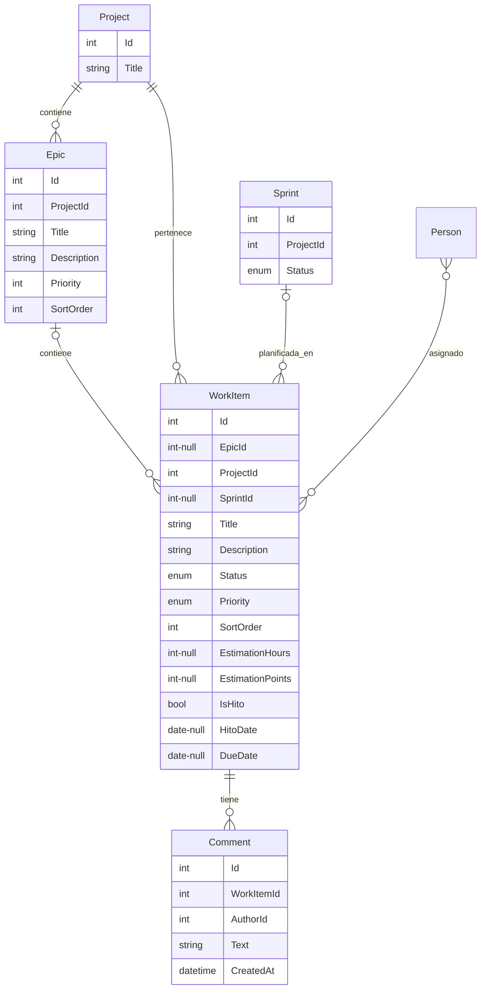

# Épicas, Tareas y Backlog

## Descripción

Gestión del trabajo a nivel granular. Los proyectos se descomponen en épicas y tareas. Existen también tareas sin proyecto (backlog general) para trabajo que no pertenece a ningún proyecto específico.

## Modelo de datos

> **Nota**: `WorkItem.ProjectId` es **obligatorio** — toda tarea pertenece a un proyecto. `EpicId` es nullable (backlog del proyecto sin épica asignada) y `SprintId` es nullable (tarea aún no planificada en un sprint). No existe un "backlog general" sin proyecto: el backlog es siempre el conjunto de tareas de un proyecto en estado `Backlog` o sin épica.

> `WorkItem` admite **múltiples personas asignadas** (relación many-to-many vía `Assignees`), no un único `AssignedToId`. `Priority` es un enum (`Low`/`Medium`/`High`/`Critical`), no un entero libre. La estimación se modela como dos campos numéricos independientes, `EstimationHours` y `EstimationPoints`, no como texto libre.

## Historias de Usuario

### HU-TB-01: Crear épica dentro de un proyecto

**Como** jefe de equipo o gestor de cartera,
**quiero** crear épicas dentro de un proyecto,
**para** organizar el trabajo en bloques funcionales grandes.

**Criterios de aceptación:**
- Una épica tiene título, descripción y prioridad
- Pertenece a un único proyecto
- Se pueden reordenar las épicas dentro del proyecto
- Se muestra el progreso de la épica (% de tareas completadas)

---

### HU-TB-02: Crear tarea dentro de una épica

**Como** desarrollador, jefe de equipo o gestor de cartera,
**quiero** crear tareas dentro de una épica,
**para** desglosar el trabajo en unidades ejecutables.

**Criterios de aceptación:**
- Una tarea tiene título, descripción, prioridad (`Low`/`Medium`/`High`/`Critical`) y estimación opcional en horas (`EstimationHours`) y/o puntos de historia (`EstimationPoints`) — son dos campos numéricos independientes, no texto libre
- Se asigna a una épica dentro de un proyecto (la épica es opcional, el proyecto es obligatorio)
- Se crea en estado "Backlog" por defecto
- Se puede asignar a una o varias personas del equipo
- Opcionalmente puede marcarse como hito (`IsHito`) con una fecha objetivo (`HitoDate`), y/o tener una fecha de vencimiento (`DueDate`)

---

### HU-TB-03: Crear tarea sin épica dentro de un proyecto

**Como** desarrollador, jefe de equipo o gestor de cartera,
**quiero** crear tareas dentro de un proyecto sin asignarlas todavía a una épica,
**para** registrar trabajo pendiente de clasificar sin perder la trazabilidad del proyecto al que pertenece.

**Criterios de aceptación:**
- La tarea tiene proyecto obligatorio, pero la épica es opcional
- Aparece en el backlog del proyecto (ver HU-TB-06)
- Se puede asignar a una o varias personas
- Posteriormente se puede vincular a una épica si se decide

---

### HU-TB-04: Cambiar estado de una tarea

**Como** desarrollador,
**quiero** mover una tarea entre estados,
**para** reflejar el progreso de mi trabajo.

**Criterios de aceptación:**
- Estados: Backlog → To Do → In Progress → Blocked / Done
- El cambio de estado se registra con fecha y usuario
- Cualquier estado (excepto Done) puede retroceder a cualquier estado anterior
- Una tarea en Done **no puede retroceder** de estado; si es necesario reabrir el trabajo, se crea una nueva tarea
- Un desarrollador puede cambiar el estado de sus tareas asignadas
- Un jefe de equipo puede cambiar el estado de cualquier tarea de los equipos asignados al proyecto (no solo su equipo primario)

---

### HU-TB-05: Asignar tarea a una o varias personas

**Como** jefe de equipo,
**quiero** asignar una tarea a uno o varios desarrolladores de mi equipo,
**para** distribuir el trabajo y que quede claro quién es responsable.

**Criterios de aceptación:**
- Solo se puede asignar a personas que pertenecen a un equipo del proyecto
- Una tarea admite **múltiples personas asignadas simultáneamente**
- El desarrollador puede autoasignarse tareas no asignadas
- Al asignar, la tarea aparece en el Kanban personal de cada persona asignada

---

### HU-TB-06: Ver backlog de un proyecto

**Como** jefe de equipo,
**quiero** ver todas las tareas pendientes de planificar en un proyecto,
**para** priorizar qué se trabaja a continuación.

**Criterios de aceptación:**
- Se muestran las tareas en estado "Backlog" del proyecto
- Se pueden reordenar por prioridad (drag & drop)
- Se muestra la épica a la que pertenece cada tarea (si tiene)
- Se puede filtrar por épica y por sprint (incluyendo "sin sprint asignado")

---

### HU-TB-08: Añadir comentario a una tarea

**Como** desarrollador,
**quiero** añadir comentarios a una tarea,
**para** documentar decisiones, bloqueos o progreso.

**Criterios de aceptación:**
- Los comentarios tienen texto, autor y fecha
- Cualquier persona con acceso al proyecto puede comentar
- Los comentarios se muestran en orden cronológico
- El agente IA puede añadir comentarios en nombre del usuario
