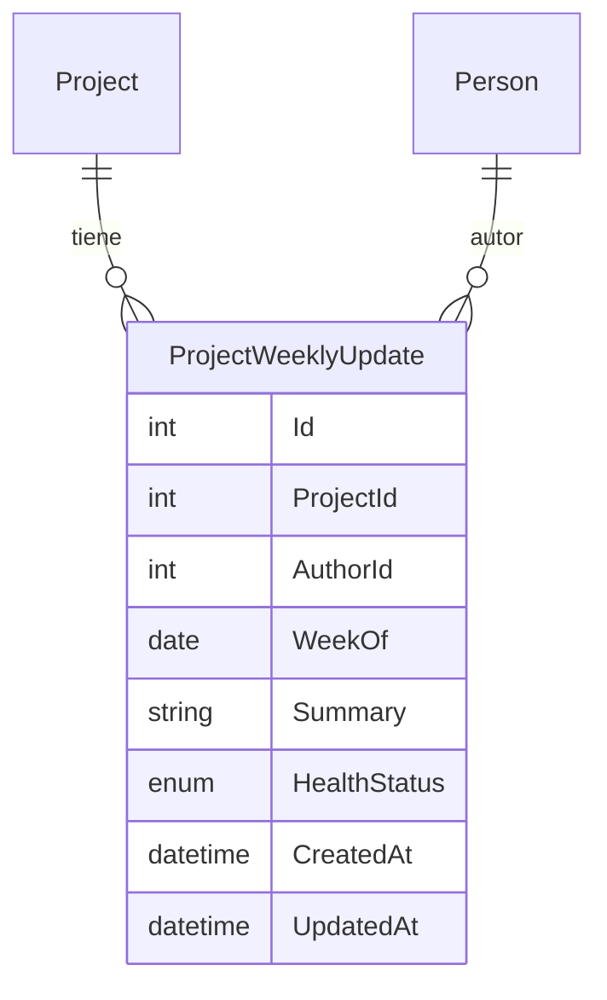

# Informes y Seguimiento

## Descripción

Generación de informes sobre el estado de la cartera, avance de proyectos y actividad de los equipos. El pilar de este módulo es el **seguimiento semanal**: los desarrolladores y jefes de equipo registran cada semana un avance breve por proyecto, y el gestor de cartera obtiene con un solo clic un informe global que reúne esos avances de todos los proyectos en curso, sin tener que preguntar proyecto por proyecto.

> **Estado de implementación:** esta sección describe el comportamiento objetivo. A fecha de esta revisión, `GetPortfolio`, `GetProjectReport` y `GetCapacity` están implementados; el resto de HUs de este documento (seguimiento semanal, informe global de un clic, feed de actividad, productividad de equipo, exportación PDF) están **pendientes de implementación** — ver plan de implementación.

## Modelo de datos — Seguimiento semanal

| Enum | Valores |
|------|---------|
| `ProjectHealthStatus` | `OnTrack` (En curso, verde), `AtRisk` (En riesgo, amarillo), `Blocked` (Bloqueado, rojo) |

- `WeekOf` se normaliza siempre al lunes de la semana ISO en curso
- Clave lógica `ProjectId + AuthorId + WeekOf`: como máximo una actualización por proyecto, autor y semana — si ya existe una para la semana en curso, registrar otra la actualiza (upsert) en lugar de duplicarla
- Un proyecto puede tener varias actualizaciones la misma semana si varios miembros de equipo registran la suya (cada una con su propio autor)

## Definición de "proyecto en riesgo"

Un proyecto se considera **en riesgo** en el informe global si se cumple alguna de estas condiciones:
1. Su última actualización semanal tiene `HealthStatus = AtRisk` o `Blocked`, o
2. Está en un estado "en curso" (cualquiera salvo `Stopped`, `Completed`, `PostponedByClient`) y **no tiene ninguna actualización semanal registrada en la semana ISO en curso**

Esta definición sustituye cualquier heurística basada solo en fechas: el riesgo lo declara explícitamente la persona que está trabajando en el proyecto, y la ausencia de parte semanal es en sí misma una señal de riesgo (proyecto sin seguimiento).

## Historias de Usuario

### HU-IN-00: Registrar avance semanal de un proyecto

**Como** desarrollador o jefe de equipo asignado a un proyecto,
**quiero** registrar cada semana un resumen breve de mi avance y mi valoración del estado de salud del proyecto,
**para** que el gestor de cartera tenga visibilidad continua sin tener que preguntar manualmente.

**Criterios de aceptación:**
- Cualquier miembro de un equipo asignado al proyecto (Desarrollador o Jefe de equipo) puede registrar una actualización semanal; el Gestor también puede hacerlo en cualquier proyecto
- Campos: resumen en texto libre (obligatorio, máx. 1000 caracteres) y estado de salud `OnTrack` / `AtRisk` / `Blocked` (obligatorio)
- Si la persona ya registró una actualización para la semana ISO en curso en ese proyecto, la acción la actualiza (upsert) en lugar de crear una duplicada
- Las actualizaciones se muestran en el detalle del proyecto en orden cronológico inverso, con indicador visual de semáforo según `HealthStatus`
- Pensado para rellenarse en segundos: el flujo habitual es desde "Mis tareas" o el dashboard del desarrollador, con un recordatorio visual si aún no ha registrado avance esta semana en alguno de sus proyectos activos
- El agente IA puede registrar una actualización semanal en nombre del usuario mediante lenguaje natural (ver `10-integracion-agente-ia.md`)

---

### HU-IN-01: Generar informe de estado de cartera

**Como** gestor de cartera,
**quiero** generar un informe con el estado de todos los proyectos de la cartera de un año,
**para** reportar el avance a la dirección.

**Criterios de aceptación:**
- Se selecciona el año de cartera
- El informe incluye: lista de proyectos con estado, % avance (tareas Done / total tareas × 100), equipo asignado
- Resumen: proyectos por estado (gráfico), proyectos en riesgo (ver definición arriba)
- Exportable a Excel reutilizando el mismo patrón ya implementado para el agente IA (generación en cliente/handler + descarga, sin lógica de render en el dominio); la exportación a PDF queda pospuesta a una iteración posterior

---

### HU-IN-05: Generar informe de seguimiento semanal de cartera con un clic

**Como** gestor de cartera,
**quiero** generar con un solo clic un informe que reúna el último avance semanal de todos los proyectos de cartera en curso,
**para** tener una foto completa y honesta del estado real sin recorrer proyecto por proyecto.

**Criterios de aceptación:**
- Una única acción (botón en el dashboard o tool del agente IA) genera el informe sin filtros obligatorios; admite filtros opcionales por año de cartera, equipo y grupo SIPT
- Incluye únicamente proyectos "en curso" (cualquier estado salvo `Stopped`, `Completed`, `PostponedByClient`)
- Por cada proyecto se muestra: título, equipo principal, estado del proyecto, y su última actualización semanal (resumen + `HealthStatus` + autor + fecha) o una marca explícita de "sin actualización esta semana" si no la hay
- Los proyectos en riesgo (ver definición arriba) se resaltan y se listan en primer lugar
- El informe se sirve desde una única query (`GetWeeklyPortfolioReport`), reutilizable también como tool del agente IA
- Exportable a Excel con el mismo mecanismo que HU-IN-01; la exportación a PDF queda pospuesta

---

### HU-IN-02: Generar informe de avance de un proyecto

**Como** jefe de equipo,
**quiero** generar un informe de avance de un proyecto específico,
**para** documentar el progreso y compartirlo con la unidad solicitante.

**Criterios de aceptación:**
- Incluye: épicas con % completado (tareas Done / total tareas de la épica × 100), tareas completadas vs pendientes
- Historial de actividad reciente (últimos cambios de estado, comentarios) y de actualizaciones semanales (HU-IN-00)
- Hitos: tareas marcadas con `IsHito = true`. Se muestran agrupadas en "alcanzados" (Done) y "próximos" (no Done), ordenados por `HitoDate`
- Exportable a PDF

---

### HU-IN-03: Ver actividad reciente

**Como** gestor de cartera,
**quiero** ver un feed de actividad reciente en la plataforma,
**para** estar al día de lo que está pasando sin tener que revisar proyecto por proyecto.

**Criterios de aceptación:**
- Se muestra: cambios de estado, nuevas tareas, tareas completadas, comentarios, actualizaciones semanales de avance (HU-IN-00)
- Filtrable por proyecto, equipo o persona
- Orden cronológico inverso (más reciente primero)
- Paginado (20 ítems por página)

---

### HU-IN-04: Informe de productividad de equipo

**Como** gestor de cartera,
**quiero** ver métricas de productividad por equipo en un período,
**para** identificar tendencias y posibles problemas.

**Criterios de aceptación:**
- Métricas: tareas completadas, tiempo medio en cada estado, tareas creadas vs completadas
- Selección de rango de fechas
- Comparativa entre equipos
- Visualización con gráficos
