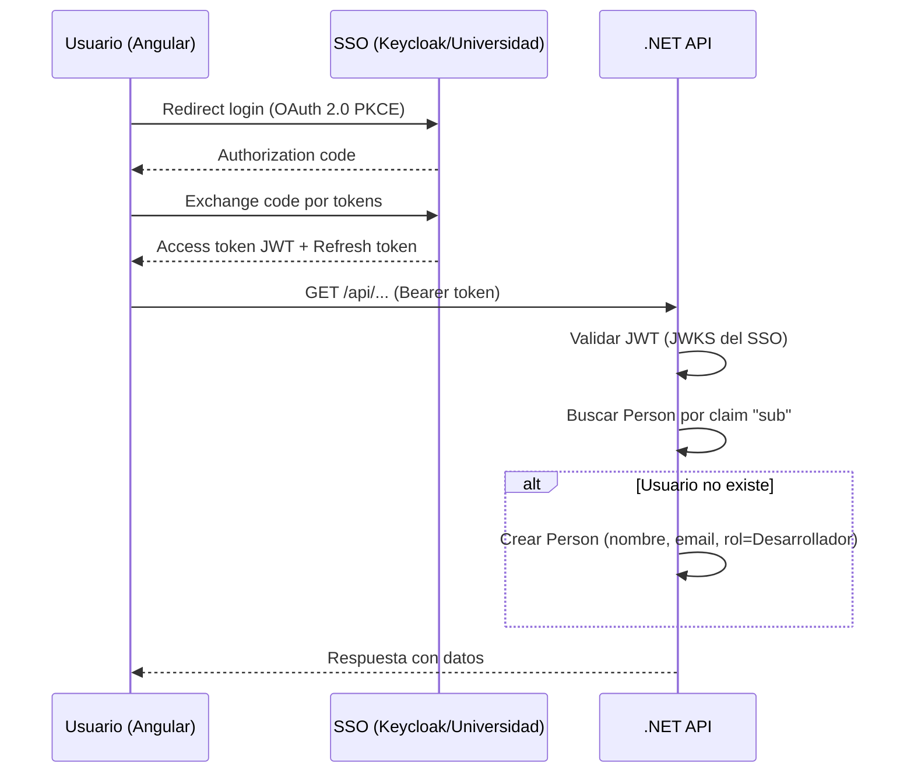

# Autenticación y Roles

## Descripción

Integración con el SSO de la universidad para autenticación y sistema de autorización basado en roles para controlar el acceso a funcionalidades. No se usa ASP.NET Identity; los usuarios se provisionan automáticamente a partir de los claims del JWT.

## Flujo de autenticación

## Provisión automática de usuarios

- Al recibir un JWT válido, el middleware busca al usuario en la tabla `Person` por el claim `sub`
- Si no existe, se crea con: nombre (claim `name`), email (claim `email`), rol Desarrollador
- El gestor de cartera puede después cambiar el rol y asignar a equipos
- No hay formulario de registro ni gestión de contraseñas en la aplicación

## Roles del sistema

| Rol | Permisos principales |
|-----|---------------------|
| Gestor de cartera | Acceso total: CRUD proyectos, equipos, personas, épicas, tareas, informes, asignar roles |
| Jefe de equipo | Crear épicas y tareas; gestionar tareas de **cualquier equipo asignado al proyecto**; ver carga; generar informes de sus proyectos |
| Desarrollador | Crear tareas, autoasignarse, actualizar estado de sus propias tareas |

## Historias de Usuario

### HU-AU-01: Iniciar sesión con SSO

**Como** usuario de la universidad,
**quiero** iniciar sesión con mis credenciales universitarias,
**para** acceder a la plataforma sin crear una cuenta nueva.

**Criterios de aceptación:**
- El login redirige al SSO de la universidad (OAuth 2.0 PKCE)
- Una vez autenticado, se redirige de vuelta a la aplicación
- Si el usuario no existe en la plataforma, se crea automáticamente con rol Desarrollador
- La sesión se mantiene activa con refresh tokens

---

### HU-AU-02: Gestionar roles de usuarios

**Como** gestor de cartera,
**quiero** asignar roles a los usuarios de la plataforma,
**para** controlar quién puede hacer qué.

**Criterios de aceptación:**
- Roles disponibles: Gestor de cartera, Jefe de equipo, Desarrollador
- Un usuario puede tener un solo rol principal
- Solo el Gestor de cartera puede cambiar roles
- El cambio de rol se aplica inmediatamente

---

### HU-AU-03: Restricción de acciones por rol

**Como** sistema,
**quiero** restringir las acciones disponibles según el rol del usuario,
**para** mantener la integridad de los datos y la gobernanza.

**Criterios de aceptación:**
- **Gestor de cartera**: acceso total (CRUD proyectos, equipos, personas, épicas, tareas, informes, asignar roles)
- **Jefe de equipo**: crear épicas y tareas; gestionar tareas de cualquier equipo asignado al proyecto; ver carga de su equipo; generar informes de sus proyectos
- **Desarrollador**: crear tareas, autoasignarse tareas no asignadas, actualizar estado de sus propias tareas
- Los endpoints de la API devuelven 403 si el usuario no tiene permisos
- El frontend oculta opciones no disponibles para el rol

---

### HU-AU-04: API Key para agentes IA

> **⏳ Pospuesta a v2.** En v1, la API Key del Tool Server es una clave estática configurada en variables de entorno (no gestionable desde la UI). La gestión de múltiples API Keys con revocación y auditoría se implementará en una versión posterior.

**Comportamiento en v1:**
- Una única API Key estática configurada vía variable de entorno `Agent__ApiKey`
- El Tool Server de Open WebUI la presenta en el header `Authorization: Bearer <api-key>`
- No hay UI para gestionar la clave; se rota actualizando la variable de entorno y reiniciando el servicio
