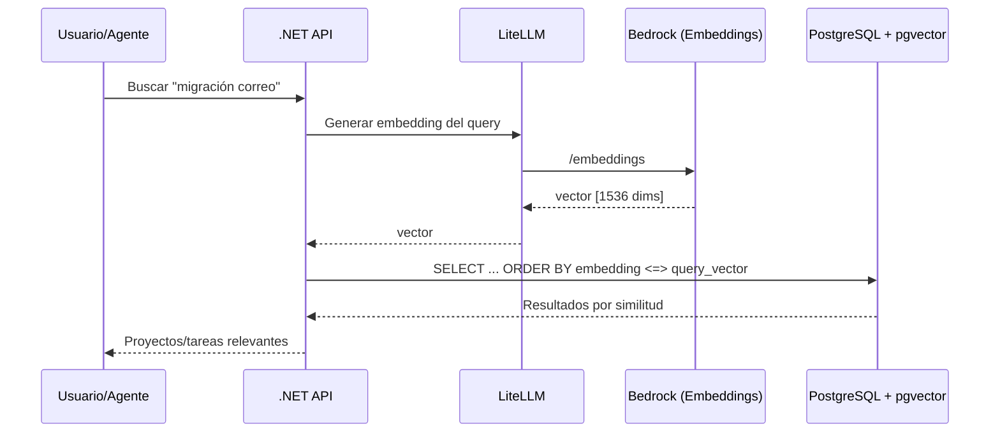

# Búsqueda Semántica

## Descripción

Búsqueda inteligente sobre proyectos y tareas utilizando embeddings vectoriales (pgvector), permitiendo encontrar información por significado y no solo por coincidencia exacta de texto.

## Arquitectura

## Historias de Usuario

### HU-BS-01: Buscar proyectos por descripción natural

**Como** gestor de cartera,
**quiero** buscar proyectos usando lenguaje natural,
**para** encontrar proyectos relacionados con un tema sin necesitar el título exacto.

**Criterios de aceptación:**
- La búsqueda "migración del correo electrónico" encuentra proyectos sobre email/Exchange/correo
- Se muestran resultados ordenados por relevancia
- Se combina búsqueda semántica con filtros tradicionales (estado, equipo, año)
- Tiempo de respuesta < 2 segundos

---

### HU-BS-02: Buscar tareas similares

**Como** desarrollador,
**quiero** buscar tareas existentes por descripción,
**para** evitar duplicados y encontrar trabajo relacionado.

**Criterios de aceptación:**
- Al crear una tarea, se sugieren tareas similares existentes
- La búsqueda funciona sobre título y descripción de tareas
- Se puede buscar en todos los proyectos o filtrar por proyecto

---

### HU-BS-03: Indexación automática de contenido

**Como** sistema,
**quiero** generar embeddings automáticamente al crear o actualizar proyectos y tareas,
**para** mantener la búsqueda semántica actualizada sin intervención manual.

**Criterios de aceptación:**
- Al crear/editar un proyecto o tarea, se genera el embedding de forma asíncrona
- Se usa el endpoint de embeddings de LiteLLM/Bedrock
- Los vectores se almacenan en pgvector
- Si el servicio de embeddings no está disponible, la operación CRUD no falla (degradación elegante)
