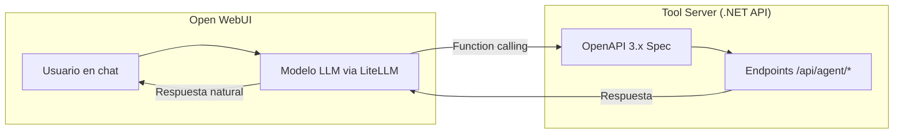

# Integración con Agente IA

## Descripción

Integración de la plataforma con Open WebUI mediante OpenAPI Tool Server, permitiendo a los usuarios interactuar con la cartera de proyectos a través de lenguaje natural. Los agentes pueden consultar datos y ejecutar acciones.

## Arquitectura de integración

## Configuración

- La API .NET se registra en Open WebUI → Settings → Tools como OpenAPI Tool Server
- LiteLLM actúa como proxy a AWS Bedrock con function calling habilitado
- La autenticación del Tool Server se realiza con API Key
- Las descripciones de los endpoints están optimizadas para que el LLM las entienda

## Historias de Usuario

### HU-IA-01: Consultar estado de proyecto vía chat

**Como** gestor de cartera,
**quiero** preguntar al agente IA sobre el estado de un proyecto,
**para** obtener información rápida sin navegar por la interfaz.

**Criterios de aceptación:**
- Pregunta ejemplo: "¿Cómo va el proyecto de migración de LDAP?"
- El agente responde con: estado, % avance, tareas pendientes, equipo asignado
- Si hay ambigüedad, el agente pregunta a cuál proyecto se refiere
- Funciona desde Open WebUI

---

### HU-IA-02: Consultar carga de equipo vía chat

**Como** gestor de cartera,
**quiero** preguntar al agente qué equipo tiene más disponibilidad,
**para** decidir asignaciones sin abrir dashboards.

**Criterios de aceptación:**
- Pregunta ejemplo: "¿Qué equipo tiene más capacidad para asumir un proyecto nuevo?"
- El agente responde con la carga de cada equipo y recomienda
- Puede detallar si se le pregunta por un equipo concreto

---

### HU-IA-03: Actualizar estado de tarea vía chat

**Como** desarrollador,
**quiero** decirle al agente que he terminado una tarea,
**para** actualizar el estado sin entrar en la aplicación web.

**Criterios de aceptación:**
- Frase ejemplo: "He terminado la tarea de configurar el reverse proxy"
- El agente identifica la tarea por búsqueda semántica
- Pide confirmación antes de cambiar el estado
- Si hay ambigüedad muestra opciones para que el usuario elija
- El cambio se refleja inmediatamente en el Kanban

---

### HU-IA-04: Crear tarea vía chat

**Como** desarrollador,
**quiero** crear una tarea nueva mediante el chat,
**para** registrar trabajo pendiente de forma rápida.

**Criterios de aceptación:**
- Frase ejemplo: "Necesito crear una tarea para revisar los certificados SSL del proxy"
- El agente pregunta: ¿a qué proyecto?, ¿prioridad?, ¿te la asigno a ti?
- Se crea la tarea con los datos proporcionados
- Confirma la creación con un resumen

---

### HU-IA-05: Asignar proyecto a equipo vía chat

**Como** gestor de cartera,
**quiero** asignar un proyecto a un equipo mediante el chat,
**para** realizar asignaciones de forma rápida tras consultar la capacidad.

**Criterios de aceptación:**
- Frase ejemplo: "Asigna el proyecto de renovación de WiFi al equipo de Infraestructura"
- El agente muestra la carga actual del equipo antes de confirmar
- Pide confirmación explícita antes de ejecutar la asignación
- Confirma la asignación realizada

---

### HU-IA-06: Añadir nota de seguimiento vía chat

**Como** desarrollador,
**quiero** añadir un comentario de seguimiento a una tarea hablando con el agente,
**para** documentar mi progreso de forma natural.

**Criterios de aceptación:**
- Frase ejemplo: "Añade al proyecto de LDAP que hemos terminado la fase de testing"
- El agente identifica el proyecto/tarea y añade el comentario
- El comentario queda registrado con autoría y fecha
- Esta información se usa en los informes de seguimiento

---

### HU-IA-07: Consultar mis tareas pendientes vía chat

**Como** desarrollador,
**quiero** preguntar al agente en qué debería estar trabajando,
**para** obtener un resumen rápido de mi trabajo pendiente.

**Criterios de aceptación:**
- Pregunta ejemplo: "¿Qué tengo pendiente?" o "¿En qué estoy trabajando?"
- El agente responde con las tareas asignadas agrupadas por estado
- Indica de qué proyecto es cada tarea
- Puede sugerir prioridades basándose en las prioridades asignadas

---

### HU-IA-08: Configurar la API como Tool Server en Open WebUI

**Como** administrador,
**quiero** registrar la API de la plataforma como OpenAPI Tool Server en Open WebUI,
**para** que el agente pueda invocar los endpoints de forma nativa.

**Criterios de aceptación:**
- La API .NET expone spec OpenAPI 3.x con descripciones claras para el LLM
- Se registra la URL en Open WebUI → Settings → Tools
- La autenticación se hace con API Key
- LiteLLM está configurado como proxy hacia Bedrock con function calling
- El modelo puede invocar las tools definidas en la spec
