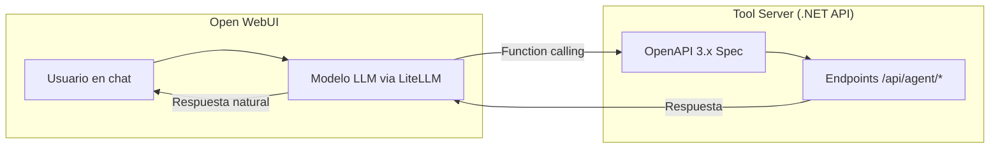
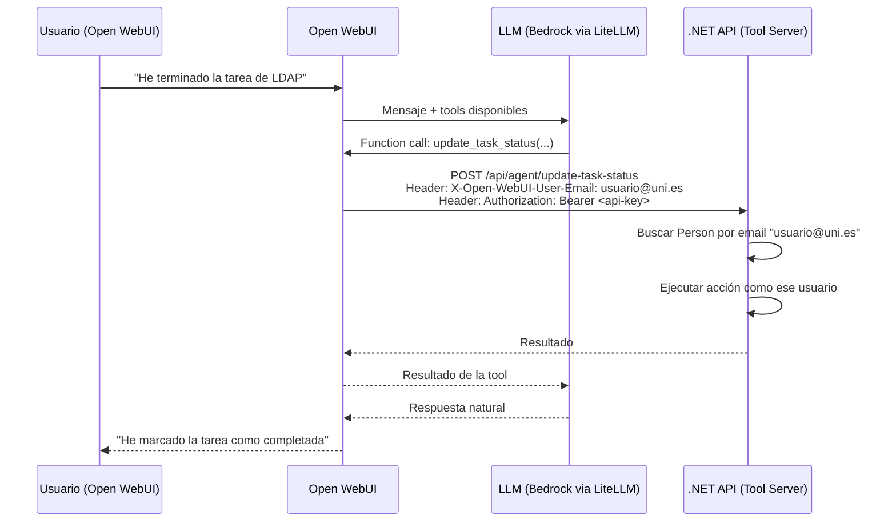

# Integración con Agente IA

## Descripción

Integración de la plataforma con Open WebUI mediante OpenAPI Tool Server, permitiendo a los usuarios interactuar con la cartera de proyectos a través de lenguaje natural. Los agentes pueden consultar datos y ejecutar acciones.

## Arquitectura de integración

## Configuración

- La API .NET se registra en Open WebUI → Settings → Tools como OpenAPI Tool Server
- LiteLLM actúa como proxy a AWS Bedrock con function calling habilitado
- La autenticación del Tool Server se realiza con API Key
- Las descripciones de los endpoints están optimizadas para que el LLM las entienda
- Open WebUI se conecta al mismo SSO (Keycloak/Universidad) que la aplicación web

## Estrategia de endpoints

Los endpoints del agente (`/api/agent/*`) **no duplican** la lógica de los endpoints del frontend. Se aplican dos estrategias:

1. **Endpoints de consulta específicos para el agente** (`/api/agent/...`): endpoints con formato de respuesta simplificado y descripciones OpenAPI optimizadas para el LLM. Internamente reutilizan los mismos handlers de MediatR que los endpoints del frontend.

2. **Endpoints de acción compartidos**: las acciones de escritura (crear tarea, cambiar estado, asignar proyecto) son los **mismos endpoints** que usa el frontend (`/api/workitems`, `/api/projects`, etc.), expuestos también como tools en la spec OpenAPI. La diferencia es solo la autenticación (API Key + header `X-Open-WebUI-User-Email` en lugar de JWT directo).

**Razón**: evitar duplicar lógica y validaciones. Los handlers MediatR garantizan que las reglas de negocio se aplican igual independientemente del origen (frontend o agente).

**El grupo `AgentEndpoints.cs`** se limita a:
- Endpoints de consulta agregada adaptados al LLM (resumen de proyecto, carga de equipo, mis tareas)
- Endpoint de búsqueda semántica de tareas (para que el agente identifique tareas por descripción natural)

## Identificación del usuario en las llamadas del agente

Open WebUI autentica a los usuarios contra el mismo SSO que la aplicación web. Al invocar un Tool Server, Open WebUI envía automáticamente el header `X-Open-WebUI-User-Email` con el email del usuario que está chateando.

### Reglas de seguridad:
- La API valida que el email del header corresponde a una `Person` existente
- Las acciones respetan los permisos del rol de esa persona (un desarrollador no puede asignar proyectos)
- El header `X-Open-WebUI-User-Email` solo se acepta desde la red interna (Docker network) con API Key válida

## Historias de Usuario

### HU-IA-01: Consultar estado de proyecto vía chat

**Como** gestor de cartera,
**quiero** preguntar al agente IA sobre el estado de un proyecto,
**para** obtener información rápida sin navegar por la interfaz.

**Criterios de aceptación:**
- Pregunta ejemplo: "¿Cómo va el proyecto de migración de LDAP?"
- El agente responde con: estado, % avance, tareas pendientes, equipo asignado
- Si hay ambigüedad, el agente pregunta a cuál proyecto se refiere
- Para listar proyectos (`get_projects`), el agente admite filtrar opcionalmente por grupo SIPT (`siptGroup`) y/o por estado (`status`)
- Funciona desde Open WebUI

---

### HU-IA-02: Consultar carga de equipo vía chat

**Como** gestor de cartera,
**quiero** preguntar al agente qué equipo tiene más disponibilidad,
**para** decidir asignaciones sin abrir dashboards.

**Criterios de aceptación:**
- Pregunta ejemplo: "¿Qué equipo tiene más capacidad para asumir un proyecto nuevo?"
- El agente responde con la carga de cada equipo y recomienda
- Puede detallar si se le pregunta por un equipo concreto

---

### HU-IA-03: Actualizar estado de tarea vía chat

**Como** desarrollador,
**quiero** decirle al agente que he terminado una tarea,
**para** actualizar el estado sin entrar en la aplicación web.

**Criterios de aceptación:**
- Frase ejemplo: "He terminado la tarea de configurar el reverse proxy"
- El agente identifica la tarea por búsqueda semántica
- Pide confirmación antes de cambiar el estado
- Si hay ambigüedad muestra opciones para que el usuario elija
- El cambio se refleja inmediatamente en el Kanban

---

### HU-IA-04: Crear tarea vía chat

**Como** desarrollador,
**quiero** crear una tarea nueva mediante el chat,
**para** registrar trabajo pendiente de forma rápida.

**Criterios de aceptación:**
- Frase ejemplo: "Necesito crear una tarea para revisar los certificados SSL del proxy"
- El agente pregunta: ¿a qué proyecto?, ¿prioridad?, ¿te la asigno a ti?
- Se crea la tarea con los datos proporcionados
- Confirma la creación con un resumen

---

### HU-IA-05: Asignar proyecto a equipo vía chat

**Como** gestor de cartera,
**quiero** asignar un proyecto a un equipo mediante el chat,
**para** realizar asignaciones de forma rápida tras consultar la capacidad.

**Criterios de aceptación:**
- Frase ejemplo: "Asigna el proyecto de renovación de WiFi al equipo de Infraestructura"
- El agente muestra la carga actual del equipo antes de confirmar
- Pide confirmación explícita antes de ejecutar la asignación
- Confirma la asignación realizada

---

### HU-IA-06: Añadir comentario de seguimiento a una tarea vía chat

**Como** desarrollador,
**quiero** añadir un comentario de seguimiento a una tarea hablando con el agente,
**para** documentar mi progreso de forma natural.

**Criterios de aceptación:**
- Frase ejemplo: "Añade un comentario a la tarea del proxy diciendo que hemos terminado la fase de testing"
- El agente identifica la tarea (por búsqueda semántica si es necesario) y añade el comentario (`add_task_comment`)
- El comentario queda registrado con autoría y fecha
- Esta información se usa en los informes de seguimiento

---

### HU-IA-06b: Añadir nota de seguimiento a un proyecto vía chat

**Como** gestor de cartera o jefe de equipo,
**quiero** añadir una nota de seguimiento a un proyecto hablando con el agente,
**para** documentar decisiones, hitos o bloqueos a nivel de proyecto sin entrar en la aplicación web.

**Criterios de aceptación:**
- Frase ejemplo: "Añade al proyecto de LDAP que hemos terminado la fase de testing"
- El agente identifica el proyecto y añade la nota (`add_project_note`, `POST /api/agent/projects/{id}/notes`)
- La nota queda registrada con autoría y fecha, y es distinta de los comentarios de tarea (HU-IA-06): vive a nivel de proyecto, no de tarea concreta
- Esta información se usa en los informes de seguimiento y es visible en el detalle del proyecto

---

### HU-IA-07: Consultar mis tareas pendientes vía chat

**Como** desarrollador,
**quiero** preguntar al agente en qué debería estar trabajando,
**para** obtener un resumen rápido de mi trabajo pendiente.

**Criterios de aceptación:**
- Pregunta ejemplo: "¿Qué tengo pendiente?" o "¿En qué estoy trabajando?"
- El agente responde con las tareas asignadas agrupadas por estado
- Indica de qué proyecto es cada tarea
- Puede sugerir prioridades basándose en las prioridades asignadas

---

### HU-IA-09: Regenerar el índice de búsqueda semántica vía chat

**Como** administrador,
**quiero** poder pedirle al agente que regenere el índice de embeddings de las tareas,
**para** asegurar que la búsqueda semántica refleja cambios masivos recientes sin tener que reiniciar el backend.

**Criterios de aceptación:**
- El agente expone la tool `reindex` (`POST /api/agent/reindex`)
- Regenera o actualiza los embeddings vectoriales de todas las tareas
- Puede tardar varios segundos según el volumen de tareas; el agente informa que la operación está en curso
- Pensada para ejecutarse tras crear o modificar tareas de forma masiva (ej. importaciones)

---

### HU-IA-08: Configurar la API como Tool Server en Open WebUI

**Como** administrador,
**quiero** registrar la API de la plataforma como OpenAPI Tool Server en Open WebUI,
**para** que el agente pueda invocar los endpoints de forma nativa.

**Criterios de aceptación:**
- La API .NET expone spec OpenAPI 3.x con descripciones claras para el LLM
- Se registra la URL en Open WebUI → Settings → Tools
- La autenticación se hace con API Key
- LiteLLM está configurado como proxy hacia Bedrock con function calling
- El modelo puede invocar las tools definidas en la spec

---

### HU-IA-10: Generar gráficos a partir de los datos consultados

**Como** usuario del agente IA,
**quiero** pedir un gráfico (tarta o barras) sobre los datos que acabo de consultar,
**para** entender visualmente la información sin tener que abrir el dashboard web.

**Criterios de aceptación:**
- Los gráficos se generan en la tool de Open WebUI (`cartera_tool.py`, Python + matplotlib), **no** en el backend .NET: la tool reutiliza las queries JSON existentes (`get_my_tasks`, `get_projects`, `get_capacity`) y solo renderiza la imagen
- El backend expone únicamente un endpoint genérico de almacenamiento efímero (`POST/GET /api/agent/charts`) para subir el PNG generado y devolver una URL corta, evitando inflar el contexto del LLM con base64
- Tools de gráfico disponibles: `chart_team_capacity` (barras), `chart_project_progress` (barras agrupadas), `chart_my_tasks_by_status` (donut o barras), `chart_projects_by_status` (tarta o barras), `chart_projects_by_team` (barras o tarta)
- Donde el dato se presta a ambos formatos (conteos por categoría), la tool acepta un parámetro `chart_type` con valores `pie` o `bar` (o `donut` como variante de `pie` en el caso de mis tareas); el LLM elige el formato según lo que pida el usuario o usa el valor por defecto de cada gráfico
- El resultado se inserta en la respuesta del chat como imagen embebida (``)

---

### HU-IA-11: Exportar el listado de proyectos a Excel

**Como** gestor de cartera,
**quiero** pedirle al agente que exporte el listado de proyectos a un fichero Excel descargable,
**para** compartirlo o trabajarlo fuera de la plataforma.

**Criterios de aceptación:**
- Tool `export_projects_excel`, con los mismos filtros opcionales que `get_projects` (`siptGroup`, `status`)
- No aplica paginación: el Excel incluye todos los proyectos que cumplen el filtro
- Columnas: ID, Título, Estado, Unidad solicitante, Equipo principal, Tareas totales, Tareas hechas, Sprints activos
- El fichero se genera en la tool de Open WebUI (Python + openpyxl) a partir de la misma query JSON que `get_projects`, no en el backend
- El backend almacena el `.xlsx` de forma efímera en el mismo almacén genérico usado para los gráficos (`POST/GET /api/agent/exports`) y devuelve una URL de descarga con el nombre de fichero correcto
- El resultado se inserta en la respuesta del chat como enlace de descarga (`[proyectos.xlsx](url)`)
